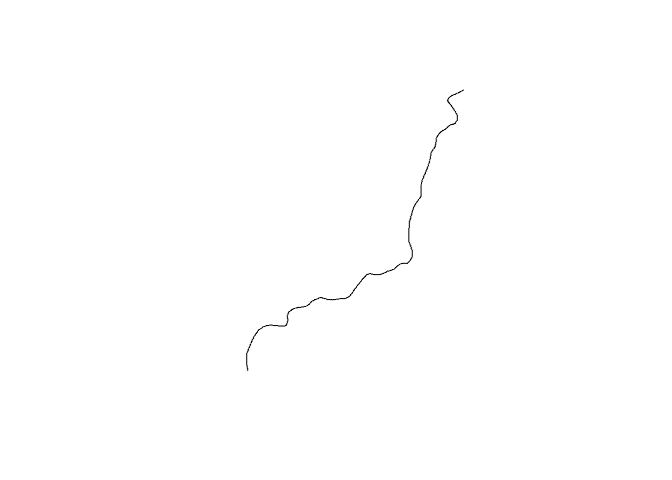

# arcgisutils

arcgisutils is the foundational infrastructure package that powers the
R-ArcGIS Bridge Data and Location Service ecosystem. It provides
sophisticated, production-ready tools for interacting with ArcGIS
Online, ArcGIS Enterprise, and ArcGIS Platform via their REST APIs.

## Key Capabilities

**🔐 Comprehensive Authentication**:

- Multiple OAuth2 workflows
  ([`auth_code()`](https://github.com/R-ArcGIS/arcgisutils/reference/auth.md),
  [`auth_client()`](https://github.com/R-ArcGIS/arcgisutils/reference/auth.md))
- API key and legacy token support
- Automatic token refresh and validation
- Integration with ArcGIS Pro via `arcgisbinding`

**🌐 Portal Integration**:

- Advanced content search with filtering, sorting, and pagination
- User, group, and organization metadata management
- Portal item discovery and content management workflows

**⚙️ Geoprocessing Services**:

- Support for the geoprocessing service framework built upon R6 and S7
- Enables users to call their own custom geoprocessing services or build
  on top of existing services
- R6-based job management (`arc_gp_job`) with real-time status tracking
  and built-in result parsing

**📄 Esri JSON Ecosystem**:

- Bidirectional conversion between R spatial data and Esri JSON formats
- Support for FeatureSets, geometry objects, field definitions, and
  spatial reference systems
- Optimized parsing with automatic `sf` integration

**🛠️ Developer Utilities**:

- Standardized HTTP client
  ([`arc_base_req()`](https://github.com/R-ArcGIS/arcgisutils/reference/arc_base_req.md),
  [`arc_paginate_req()`](https://github.com/R-ArcGIS/arcgisutils/reference/arc_paginate_req.md))
- Robust error detection and user-friendly error messages
- URL parsing, service introspection, and metadata extraction

## Installation

[arcgisutils](https://github.com/R-ArcGIS/arcgisutils) is part of the
[arcgis](https://github.com/R-ArcGIS/arcgis/) metapackage, which
provides the complete R-ArcGIS Bridge toolkit. For most users,
installing the metapackage is recommended:

``` r
install.packages("arcgis")
```

You can also install
[arcgisutils](https://github.com/R-ArcGIS/arcgisutils) individually from
CRAN:

``` r
install.packages("arcgisutils")
```

To install the development version:

``` r
pak::pak("r-arcgis/arcgisutils")
```

### Authentication

Authorization tokens are provided through the functions
[`auth_code()`](https://github.com/R-ArcGIS/arcgisutils/reference/auth.md),
[`auth_client()`](https://github.com/R-ArcGIS/arcgisutils/reference/auth.md),
[`auth_user()`](https://github.com/R-ArcGIS/arcgisutils/reference/auth.md),
[`auth_key()`](https://github.com/R-ArcGIS/arcgisutils/reference/auth.md),
and
[`auth_binding()`](https://github.com/R-ArcGIS/arcgisutils/reference/auth.md).
Additional token validation functions are provided via
[`refresh_token()`](https://github.com/R-ArcGIS/arcgisutils/reference/auth.md)
and
[`validate_or_refresh_token()`](https://github.com/R-ArcGIS/arcgisutils/reference/auth.md).

[`auth_code()`](https://github.com/R-ArcGIS/arcgisutils/reference/auth.md)
can be used for integrating into Shiny applications, for example, to
have individual users log in. We recommend using
[`auth_key()`](https://github.com/R-ArcGIS/arcgisutils/reference/auth.md)
for authenticating in non-interactive environments (for example
scheduled scripts or deployments).

Tokens are managed using
[`set_arc_token()`](https://github.com/R-ArcGIS/arcgisutils/reference/token.md)
and
[`unset_arc_token()`](https://github.com/R-ArcGIS/arcgisutils/reference/token.md).
They are fetched using
[`arc_token()`](https://github.com/R-ArcGIS/arcgisutils/reference/token.md).
[`set_arc_token()`](https://github.com/R-ArcGIS/arcgisutils/reference/token.md)
can set the token globally or set multiple named environments. Here is a
minimal example:

``` r
library(arcgisutils)
#> 
#> Attaching package: 'arcgisutils'
#> The following object is masked from 'package:base':
#> 
#>     %||%
```

``` r
key <- auth_key()
set_arc_token(key)
```

Alternatively, tokens can be set based on a key-value pair for multiple
environments:

``` r
set_arc_token("production" = prod_token, "development" = dev_token)
```

And fetched based on their name via

``` r
arc_token("production")
```

### Portal Integration

Search and discover content across your ArcGIS organization:

``` r
# Search for feature services containing "crime" data
crime_items <- search_items(
  query = "crime", 
  item_type = "Feature Service",
  max_pages = 1
)

crime_items
#> # A data frame: 50 × 46
#>    id      owner created             modified            guid  name  title type 
#>  * <chr>   <chr> <dttm>              <dttm>              <lgl> <chr> <chr> <chr>
#>  1 ea0cfe… Toro… 2023-03-28 15:02:39 2025-01-22 18:27:48 NA    Neig… Neig… Feat…
#>  2 0a239a… Toro… 2023-03-27 18:59:00 2025-08-06 14:01:27 NA    Majo… Majo… Feat…
#>  3 5e055d… JASo… 2023-04-04 17:36:59 2023-09-07 19:05:06 NA    <NA>  Sher… Feat…
#>  4 64691a… Temp… 2024-01-17 20:01:43 2024-01-17 20:04:45 NA    hate… Hate… Feat…
#>  5 7c2b78… JASo… 2023-04-04 17:49:30 2023-06-02 22:27:11 NA    <NA>  Sher… Feat…
#>  6 e0992d… balt… 2023-07-31 20:27:01 2025-01-22 21:21:01 NA    Part… Part… Feat…
#>  7 c749e3… open… 2024-02-23 19:36:34 2025-09-04 17:08:47 NA    <NA>  Crim… Feat…
#>  8 2cb53d… KASU… 2019-12-10 19:06:39 2019-12-10 19:14:27 NA    Viol… Viol… Feat…
#>  9 30644d… MyCi… 2025-03-14 14:55:06 2025-08-20 13:55:24 NA    HPD_… HPD … Feat…
#> 10 5dc4e6… iwat… 2023-06-23 22:07:21 2023-08-09 15:33:46 NA    <NA>  Prop… Feat…
#> # ℹ 40 more rows
#> # ℹ 38 more variables: typeKeywords <list>, description <chr>, tags <list>,
#> #   snippet <chr>, thumbnail <chr>, documentation <lgl>, extent <list>,
#> #   categories <list>, spatialReference <chr>, accessInformation <chr>,
#> #   classification <lgl>, licenseInfo <chr>, culture <chr>, properties <list>,
#> #   advancedSettings <lgl>, url <chr>, proxyFilter <lgl>, access <chr>,
#> #   size <int>, subInfo <int>, appCategories <list>, industries <list>, …
```

``` r
# Get detailed item information for a portal item
arc_item(crime_items$id[1])
#> <PortalItem<Feature Service>>
#> id: ea0cfecdb1de416884e6b0bf08a9e195
#> title: Neighbourhood Crime Rates Open Data
#> owner: TorontoPoliceService
```

### Developer Utilities

Always use
[`arc_base_req()`](https://github.com/R-ArcGIS/arcgisutils/reference/arc_base_req.md)
as this will handle setting the user agent and authorization token. The
function creates a standardized `httr2` request object:

``` r
# defaults to arcgis.com
host <- arc_host() 

req <- arc_base_req(host)
req
#> <httr2_request>
#> GET https://www.arcgis.com
#> Body: empty
#> Options:
#> * useragent: "arcgisutils v0.3.3.9000"
```

To handle paginated services and requests use
[`arc_paginate_req()`](https://github.com/R-ArcGIS/arcgisutils/reference/arc_paginate_req.md)
to automatically handle fetching pages.

### Esri JSON

There are also a number of utility functions for creating and parsing
Esri JSON. For example we can create an Esri `FeatureSet` json string
using
[`as_esri_featureset()`](https://github.com/R-ArcGIS/arcgisutils/reference/featureset.md)
directly from an `sf` object.

``` r
library(sf)

# load the NC SIDS dataset and extract centroids
# of the first few rows
nc <- system.file("shape/nc.shp", package = "sf") |> 
  st_read(quiet = TRUE) |> 
  st_centroid() 

# convert to json
nc_json <- as_esri_featureset(nc[1:2, 1:3])

jsonify::pretty_json(nc_json)
#> {
#>     "geometryType": "esriGeometryPoint",
#>     "spatialReference": {
#>         "wkid": 4267
#>     },
#>     "features": [
#>         {
#>             "geometry": {
#>                 "x": -81.4982290095261,
#>                 "y": 36.43139560823758
#>             },
#>             "attributes": {
#>                 "AREA": 0.114,
#>                 "CNTY_": 1825.0,
#>                 "PERIMETER": 1.442
#>             }
#>         },
#>         {
#>             "geometry": {
#>                 "x": -81.12512977849917,
#>                 "y": 36.49110847237506
#>             },
#>             "attributes": {
#>                 "AREA": 0.061,
#>                 "CNTY_": 1827.0,
#>                 "PERIMETER": 1.231
#>             }
#>         }
#>     ]
#> }
```

Feature set json can also be parsed using
[`parse_esri_json()`](https://github.com/R-ArcGIS/arcgisutils/reference/parse_esri_json.md).

``` r
parse_esri_json(nc_json)
#> Simple feature collection with 2 features and 3 fields
#> Geometry type: POINT
#> Dimension:     XY
#> Bounding box:  xmin: -81.49823 ymin: 36.4314 xmax: -81.12513 ymax: 36.49111
#> Geodetic CRS:  NAD27
#>    AREA CNTY_ PERIMETER                   geometry
#> 1 0.114  1825     1.442  POINT (-81.49823 36.4314)
#> 2 0.061  1827     1.231 POINT (-81.12513 36.49111)
```

Additionally, sf’s `crs` object can be converted to a
[`spatialReference`](https://developers.arcgis.com/documentation/common-data-types/geometry-objects.htm#GUID-DFF0E738-5A42-40BC-A811-ACCB5814BABC)
JSON object using
[`validate_crs()`](https://github.com/R-ArcGIS/arcgisutils/reference/validate_crs.md).
Convert these to json with `yyjsonr` or `jsonify`.

``` r
crs <- validate_crs(27700)
jsonify::pretty_json(crs, unbox = TRUE)
#> {
#>     "spatialReference": {
#>         "wkid": 27700
#>     }
#> }
```

### Geoprocessing Services

The geoprocessing service framework is completely supported in
[arcgisutils](https://github.com/R-ArcGIS/arcgisutils). Here we combine
the functionality of the geoprocessing job framework with utilities such
as
[`as_esri_featureset()`](https://github.com/R-ArcGIS/arcgisutils/reference/featureset.md)
to call the [Trace DownStream Elevation
Service](https://developers.arcgis.com/rest/elevation-analysis/trace-downstream/)

``` r
trace_downstream <- function(
  input_points,
  point_id_field = NULL,
  resolution = NULL,
  generalize = FALSE,
  token = arc_token()
) {

  # create a list of parameters
  params <- compact(list(
    InputPoints = as_esri_featureset(input_points),
    PointIdField = point_id_field,
    DataSourceResolution = resolution,
    Generalize = as.character(generalize),
    f = "json"
  ))

  service_url <- "https://hydro.arcgis.com/arcgis/rest/services/Tools/Hydrology/GPServer/TraceDownstream"
  arc_gp_job$new(
    base_url = service_url,
    params = params,
    result_fn = parse_gp_feature_record_set,
    token
  )
}
```

This new function can be called to start a new job:

``` r
# create input points
input_points <- st_sfc(
  st_point(c(-159.548936, 21.955888)),
  crs = 4326
)

# initialze an empty job
job <- trace_downstream(
  input_points,
  token = auth_user()
)

# start the job
job$start()
#> <arc_gp_job>
#> Job ID: jd9f76de1e62e4d8a877f3e6859fdb7b2
#> Status: not started
#> Resource: /TraceDownstream
#> Params:
#> • InputPoints
#> • Generalize
#> • f
```

Jobs run asynchronously so we can check the status with `job$status`

``` r
job$status
#> <arcgisutils::arc_job_status>
#>  @ status: chr "esriJobSubmitted"
```

Then, when the job is complete, we can fetch the results applying the
result function which is
[`parse_gp_feature_record_set()`](https://github.com/R-ArcGIS/arcgisutils/reference/gp_params.md)
in this case.

``` r
job$results
#> $param_name
#> [1] "OutputTraceLine"
#> 
#> $data_type
#> [1] "GPFeatureRecordSetLayer"
#> 
#> $geometry
#> Simple feature collection with 1 feature and 6 fields
#> Geometry type: MULTILINESTRING
#> Dimension:     XY
#> Bounding box:  xmin: 438895 ymin: 2422310 xmax: 443325 ymax: 2428045
#> Projected CRS: NAD83 / UTM zone 4N + Unknown VCS
#>   OBJECTID PourPtID               Description DataResolution LengthKm
#> 1        1        1 NED 10m processed by Esri           10.0 9.489823
#>   Shape_Length                       geometry
#> 1     9489.823 MULTILINESTRING ((443325 24...

# store and view the results
res <- job$results
res
#> $param_name
#> [1] "OutputTraceLine"
#> 
#> $data_type
#> [1] "GPFeatureRecordSetLayer"
#> 
#> $geometry
#> Simple feature collection with 1 feature and 6 fields
#> Geometry type: MULTILINESTRING
#> Dimension:     XY
#> Bounding box:  xmin: 438895 ymin: 2422310 xmax: 443325 ymax: 2428045
#> Projected CRS: NAD83 / UTM zone 4N + Unknown VCS
#>   OBJECTID PourPtID               Description DataResolution LengthKm
#> 1        1        1 NED 10m processed by Esri           10.0 9.489823
#>   Shape_Length                       geometry
#> 1     9489.823 MULTILINESTRING ((443325 24...

# plot the resultant geometry
plot(st_geometry(res$geometry))
```



## Learn More

To learn more about the R-ArcGIS Bridge project visit the [developer
documentation](https://developers.arcgis.com/r-bridge/).
